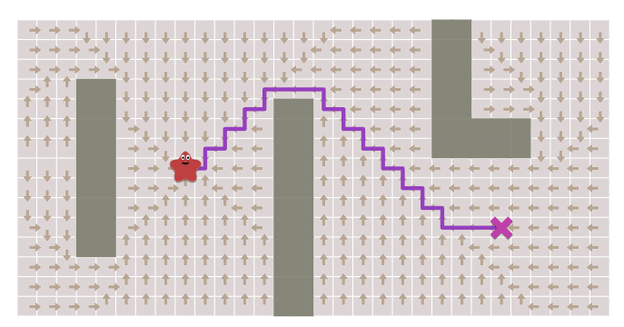

향후 이어지는 알고리즘들에서 사용되는 가장 기본적인 개념은 '***고리***(*frontier*)'이다. 고리는 시작 노드를 기점으로 모든 방향으로 끝없이 뻗어나가는 고리로, 그래프 전체를 우선적으로 탐색하는데 사용된다. 고리가 그래프 전체를 탐색하는 과정은 다음과 같다:

1. 가장 초기의 고리는 시작 노드와 이웃한 모든 노드를 포함한다.
2. 고리에서 노드 하나를 고른다.
3. 고른 노드와 이웃한 모든 노드를 탐색하여, 해당 노드가 도달할 수 있는 노드라면, 고리에 포함시킨다.
4. 고른 노드와 탐색된 노드는 모두 '도착한 노드' 목록에 포함시킨다.
5. 그래프의 모든 노드를 탐색할 때 까지 2~4번 과정을 반복한다.

의사 코드는 다음과 같다:
```C#
// 고리 큐 할당
Queue<Node> frontier = new Queue();
frontier.Add(START_NODE);
// 도착한 노드 리스트 할당
List<Node> reached = new List();
reached.Add(START_NODE);

while (frontier.Size() > 0)
{
	Node currentNode = frontier.Get(); // 고리 큐의 첫번째 원소를 고름
	for (Node neighbor in currentNode.Neighbors()) // 고른 노드의 이웃 노드 중에서
	{
		if (reached.Find(neighbor) == false) // 도착하지 않은 노드가 있다면
		{
			frontier.Add(neighbor); // 그 노드에서 부터 다시 이웃 탐색 하기 위해 고리에 추가
			reached.Add(neighbor); // 그 노드에 도착!
		}	
	}		
}
	
```
<코드 1>
향후 이어지는 알고리즘들은 모두 이 로직을 따라 갈 예정이다. 의사 코드를 분석해봤다면 눈치챘겠지만, 이 로직은 도달할 수 있는 노드만을 탐색할 뿐, 실제로 최단 거리를 탐색하지는 않는다. 경로를 탐색하기 위하여, 위 로직을 살짝 변형하겠다.

```C#
// 고리 큐 할당
Queue<Node> frontier = new Queue();
frontier.Add(START_NODE);
// 경로 노드 리스트 할당
// 한 노드에서 어느 노드로 도달했는가를 저장하는 사전형
Dictionary<Node, Node> came_from = new Dictionary<Node, Node>(); // {came_from[B] == A}는 A->B를 뜻한다.
came_from[START_NODE] = null;

while (frontier.Size() > 0)
{
	Node currentNode = frontier.Get(); // 고리 큐의 첫번째 원소를 고름
	for (Node neighbor in currentNode.Neighbors()) // 고른 노드의 이웃 노드 중에서
	{
		if (reached.Find(neighbor) == false) // 도착하지 않은 노드가 있다면
		{
			frontier.Add(neighbor); // 그 노드에서 부터 다시 이웃 탐색 하기 위해 고리에 추가
			came_from[neighbor] = currentNode;  // 그 노드에 도착! 경로를 저장함
		}	
	}		
}	
```
<코드 2>
``도착`` 리스트가 ``경로`` 사전형으로 바뀌었다. 경로를 사전형으로 저장함으로써, 이 로직이 그래프를 탐색할 때 어느 방향으로 탐색했는지를 알 수 있게 되었다.
이렇게 탐색된 경로를 시각화하면 다음과 같다:


(별 모양이 ``시작 노드``, X 모양이 ``목적 노드``)


해당 그림에서 알 수 있다시피, 우리가 원하는 것과 달리, 화살표가 시작 노드에서 목적노드를 향하는 것이 아닌, 반대로 목적 노드에서 시작 노드를 향하고 있다. 이는 우리가 할당한 경로 사전형이 '다음 노드'를 저장하는 것이 아닌 '이전 노드'를 저장하기 때문이다. 그렇다면 우리가 원하는 경로로 만들려면 어떻게 해야할까? 간단하다. 그냥 화살표를 역으로 따라가면 된다.

```C#
currentNode = DESTINATION_NODE;
List<Node> shortestPath = new List<Node>() 
while (currentNode != START_NODE):
	shortestPath.Add(currentNode)
	// came_from[]를 기반으로 역으로 따라간다.
	currentNode = came_from[currentNode] // 헷갈리지 말자! came_from[]는 이전 노드를 가리킨다.

// 실제 경로의 노드 개수가 시작 노드와 목적지를 포함하여 n+2개 있다고 해보자.
// 루프가 끝난 후, shortestPath에는 다음과 같이 저장되어 있다:
// shortestPath = [목적지 노드, 노드1, 노드2, ..., 노드n]
// 시작 노드는 없다! 시작 노드를 넣기 전에 루프가 끝났기 때문.

shortestPath.Add(START_NODE) // 마지막으로 시작 노드를 최단경로에 추가하고,
shortestPath.Reverse() // 최단경로를 뒤집으면 우리가 원하는 경로 완성!
```
<코드 3>
여기까지가 가장 간단한 너비 우선 탐색 알고리즘이다. 

[<- 이전장](2.%20기본%20및%20너비%20우선%20탐색.md)  [다음장 ->](2.1%20조기%20이탈.md)
