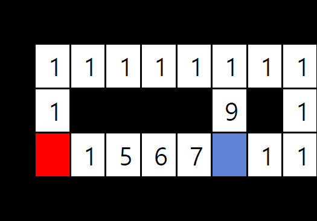

지금까지 구현한 알고리즘의 노드는 모두 똑같은 '비용'을 지닌다. 그렇다면, 노드끼리 서로 다른 비용을 지닐 수 있을까?
이때, 노드가 '비용'을 지닌다는 것은, 해당 비용만큼 알고리즘이 선호하지 않는 노드라는 뜻이다.

직관적인 예를 들어보자. 인공지능이 평지 또는 험난한 숲을 지나야한다고 가정해보자. 어느쪽을 지나는 것이 인공지능에게 유리할까? 당연한 소리겠지만, 험난한 숲 보다는 쉬운 길인 평지를 택하는 것이 나을 것이다. 이 경우, 평지에 할당된 노드의 비용이 숲에 할당된 비용보다 저렴한 셈이다.

이와 비슷한 맥락으로 비용을 노드와 노드간의 물리적인 '거리'로 이해할 수 있는데, 이에 착안해 비용을 거리 값('Distance field')으로 부르기도 한다.

이러한 비용 개념을 활용하는 개념이 너비 우선 탐색에서 확장된 "*다익스트라 알고리즘* "이다.

로직을 설명하기 위해 여태까지 작성한 코드를 가져와 조금 수정하자.
```C#
// 고리 큐 할당
PriorityQueue<Node> frontier = new PriorityQueue(); // Queue에서 PriorityQueue 클래스로 변경
frontier.Add(START_NODE, 0); // 두 번쨰 매개변수는 이제 비용으로 사용된다.


// cost_so_far은 특정 노드까지 도달하는데 거친 비용을 합한 값을 저장한다.
// 예를 들어 시작 노드에서 노드B까지 가는데 비용이 각각 1, 3, 5가 소요된다면,
// cost_so_far[노드B]는 1+3+5=9가 된다.
Dictionary<Node, int> cost_so_far = new Dictionary<Node, int>(); 
cost_so_far[START_NODE] = 0;
Dictionary<Node, Node> came_from = new Dictionary<Node, Node>(); 
came_from[START_NODE] = null;

while (frontier.Size() > 0)
{
	Node currentNode = frontier.Get(); // 고리 큐의 첫번째 원소를 고름
	
	if(currentNode == DESTINATION_NODE) // 목적지를 진작에 찾았다면
		break; // 조기 이탈!
		
	for (Node neighbor in currentNode.Neighbors()) // 고른 노드의 이웃 노드 중에서
	{
		int tempCost = cost_so_far[currentNode] + currentNode.Cost(neighbor);
		if (cost_so_far.Find(neighbor) == false || tempCost < cost_so_far[neighbor]) // 해당 노드까지의 비용이 계산되지 않았거나, 현재 경로가 저장된 경로보다 비용이 적다면
		{
			cost_so_far[neighbor] = tempCost;
			frontier.Add(neighbor, tempCost); // tempCost는 고리에서 탐색되는 새로운 노드의 '우선순위'를 나타내어, 큰 값이 들어가므로 PriorityQueue인 frontier에서 순서가 뒤로 밀려남.
			came_from[neighbor] = currentNode;  // 그 노드에 도착! 경로를 저장함
		}	
	}		
}
```




간단한 예시를 들어 이해해보자.

빨간색 노드는 시작점, 파란색 노드는 목적지, 그리고 검정색은 지나가지 못하는 장벽이라고 가정하자.
이때, 목적지 까지 갈 수 있는 방법의 수는 서쪽, 북쪽, 동쪽으로 세가지가 있다. 

만약에 너비 우선 탐색 방식과 조기 이탈 방식을 결합하여 사용한다면, 알고리즘이 목적지의 서쪽 방향으로 갔을 때 가장 적은 노드 수가 소요되어 조기 이탈할 것이다. 하지만 그림과 같이 노드에 비용이 주어져 있다면 얘기가 다르다.

목적지 까지 도달할때 소요되는 비용은 목적지까지 접근할 때 까지 밟은 노드의 비용의 합이므로, 각 방향으로 접근할 때 소요되는 비용은 다음과 같다.

|            | 서쪽                    | 북쪽                | 동쪽             |
| ---------- | --------------------- | ----------------- | -------------- |
| $\Sigma비용$ | 1 + 5 + 6 + 7 =<br>19 | 1 * 7 + 9 =<br>16 | 1 * 12 =<br>12 |

알고리즘이 서쪽 -> 북쪽 -> 동쪽 순서로 목적지에 여러번 도달한다고 생각해보자. 
서쪽에 처음 도달했을 때, 도달 ``cost_so_far[목적지]``를 19로 저장하고, 북쪽에 도달했을 때 계산된 비용이 16이므로 ``cost_so_far[목적지]``가 16으로 갱신할 것이다. 
동쪽으로 도달했을 때는 이와 같은 과정이 반복되어 ``cost_so_far[목적지]``이 12로 갱신되어 최종적으로, 다익스트라 알고리즘의 환경에서는 목적지의 동쪽으로 접근하는 것이 최적의 방향이 된다.

[<- 이전장](2.1%20조기%20이탈.md) [다음장 ->]()
